# <h1 align="center"> Lab2 Report
## 1 
### a)
The total power of a zero-mean gaussian noise is equal to its variance, so by calculating noise power, then setting its standard derivation as sqrt(noise_power), then you can generate such a noise.
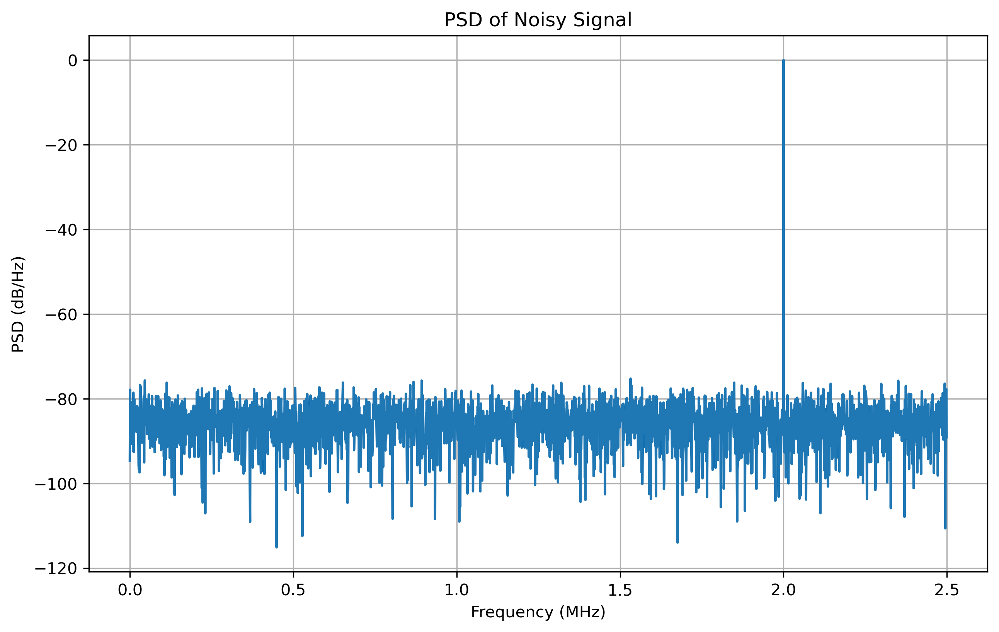

(Remember you need to integrate all the noise bin to get SNR) 

For zero-mean uniform noise, its variance is also its power. But here you need to calculate the right range to set such noise. For uniform noise with the same SNR, variance of uniform distribution is $((b-a)²/12)$ , for zero-mean: $a = -b$, so $variance = b²/3$, $b = sqrt(3 * noise_power)$

 

### b)
The 3 windowed results is given as below: 
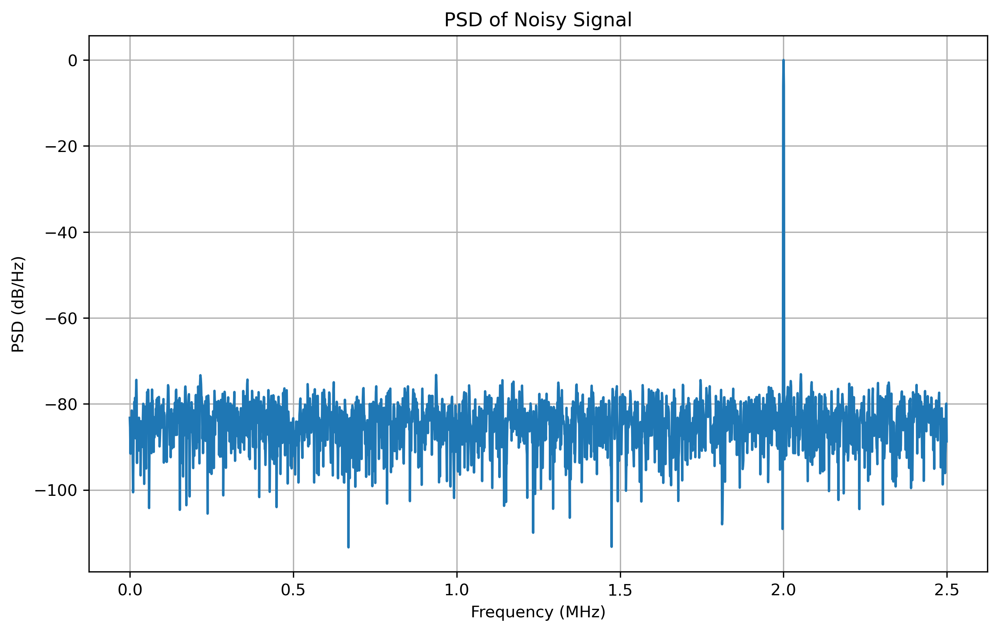

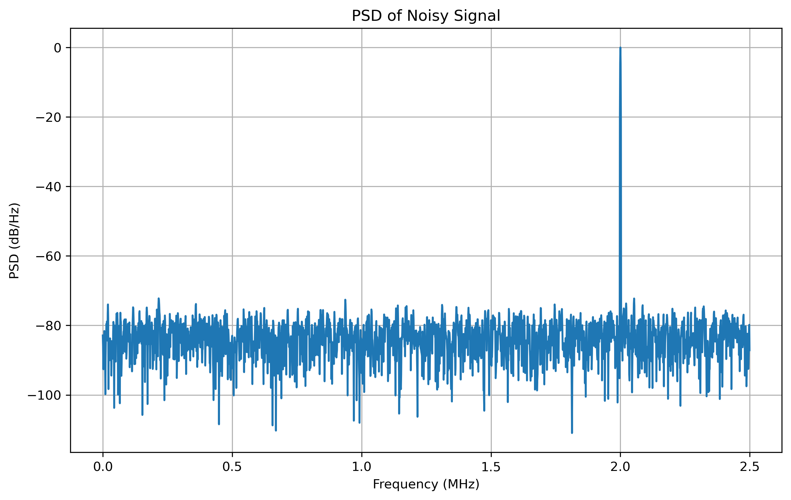
There is no significant difference because here I use the whole series length DFT, causing a high enough resolution. 

## 2
### a 
The PSD of 30 periods is: 
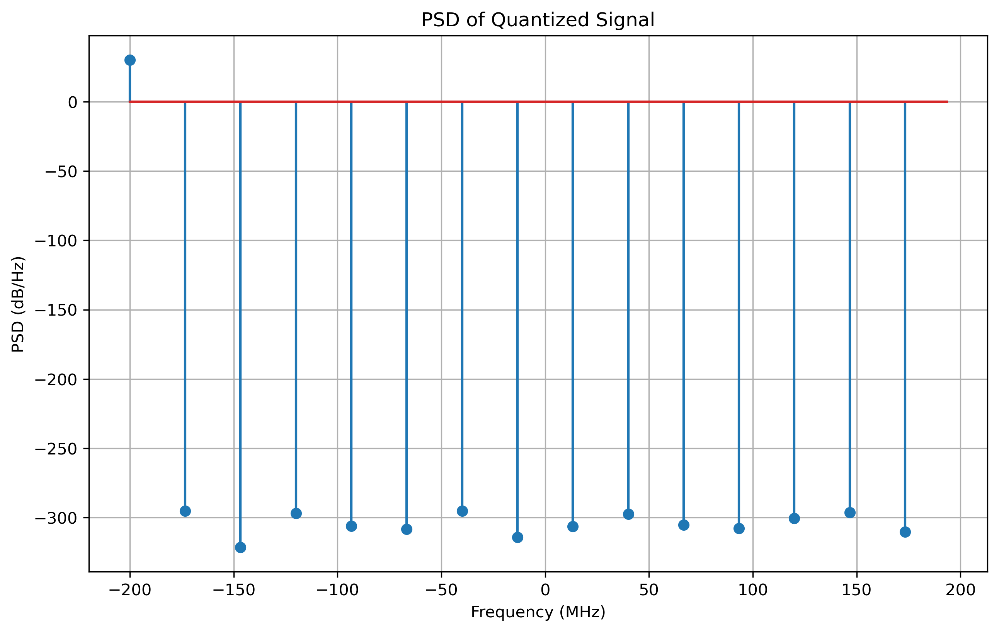
SNR = 321.5 
The PSD of 100 periods is: 
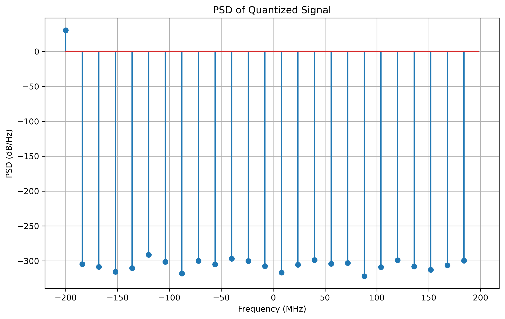
SNR = 320.3 
There shows a different but overlapped periodic distribution of noise floor. And for quantization, there is only scaling in this situation because the quantized series is [32, -32, 32, -32, ...], compared to original series [1,-1,1,-1,...]. To solve this problem, first you need to change your sampling rate to show the quantization effect, then choose M/C = fin/fs, where M is the number of samples, C is an interger cycle value, and fs/fin incommensurate. 

### b
Choose fs = 510M
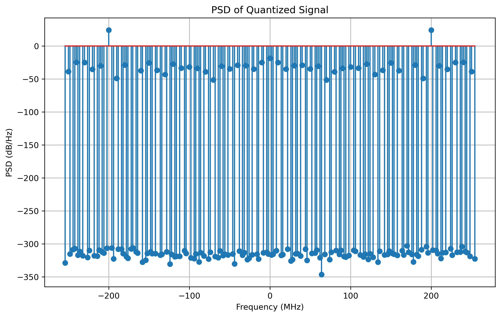
Now SNR = 39.2

### c
Change bits to 12, 30 periods vs 100 periods
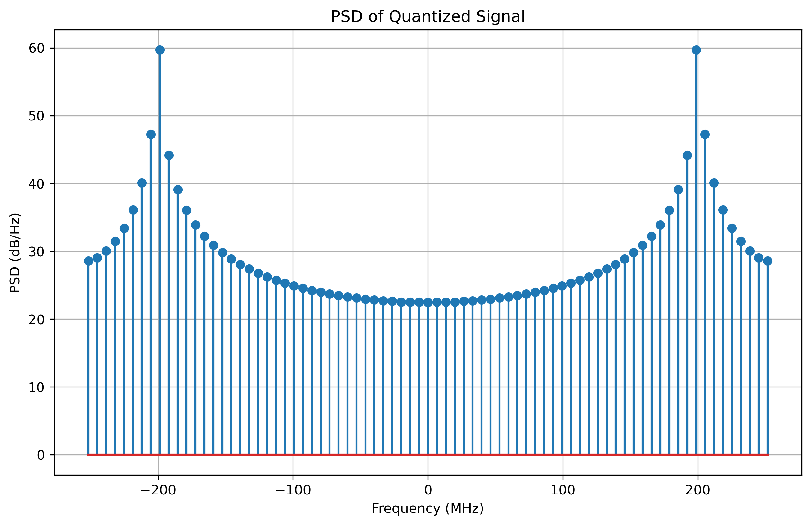
SNR = 8
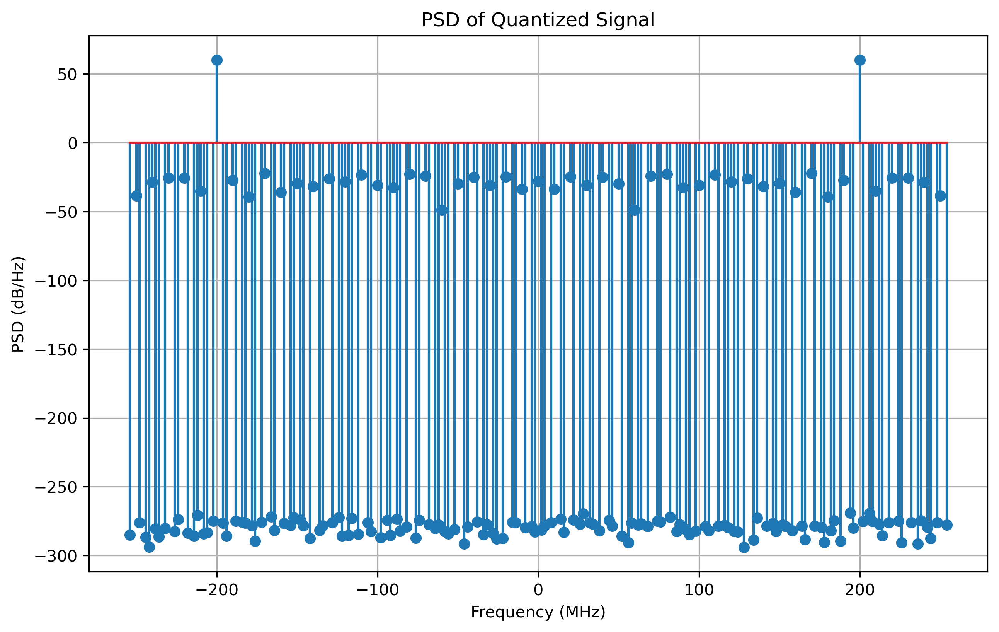
Now SNR = 73.5

In 30 periods example, significant leakage can be detected
The whole testing of 100 periods results are given as table below

| Bits | 5 | 6 | 7 | 8 | 9| 10 | 11 | 12|
|-------|-------|-------|-------|-------|-------|-------|-------|-------|
| SNR  | 31.1  | 39.2  | 43.8  |51.1 | 56.3  | 62.2  | 68.8  | 73.5|

Table1  bits vs SNR

Basically it meets SNR ~ 6N 

### d
In 30 periods situation, the leakage is actually reduced. 
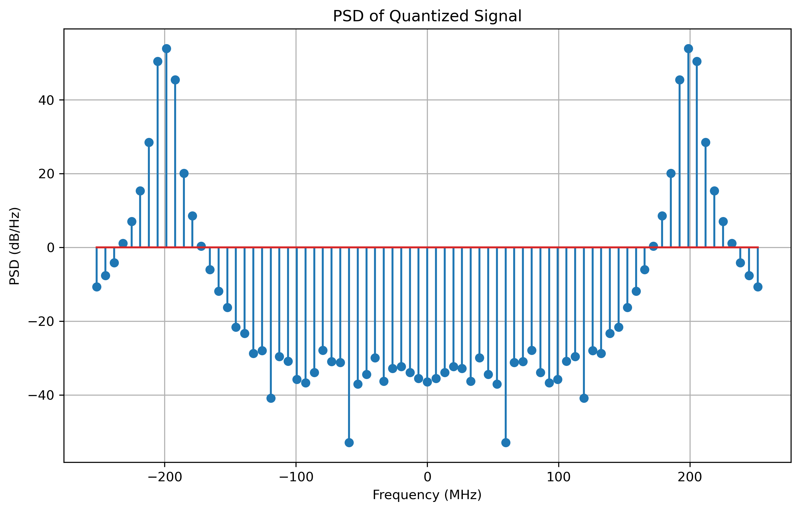
Choose to collect the [-8+signal_bin:+8+signal_bin] range, in this case SNR = 65.8, closer to 73.5
Though it can't eliminate leakage totally, but it helps. 

### e
Here I choose 100 periods of signal, add the noise after quantization. Because in this case signal level is about 61dB, to achieve a 38dB SNR finally, noise added should be 23dB. Finally I add 25dB noise. 
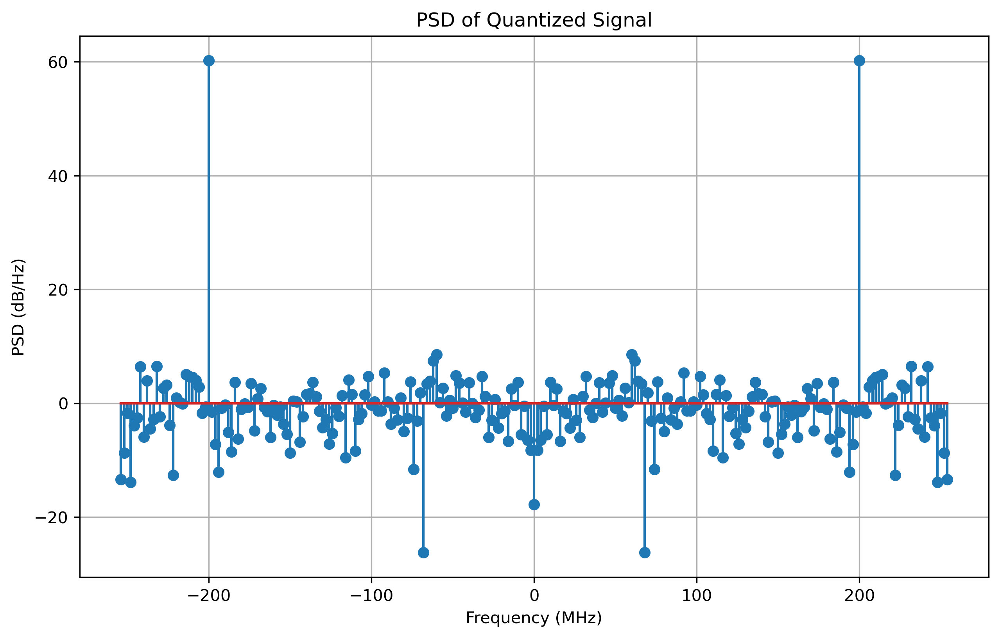
Now SNR = 38.5dB
When it comes to windowed signal, with the same noise, you can detect the power distributed to the 2 side bins, even in this case the signal has no leakage before. 
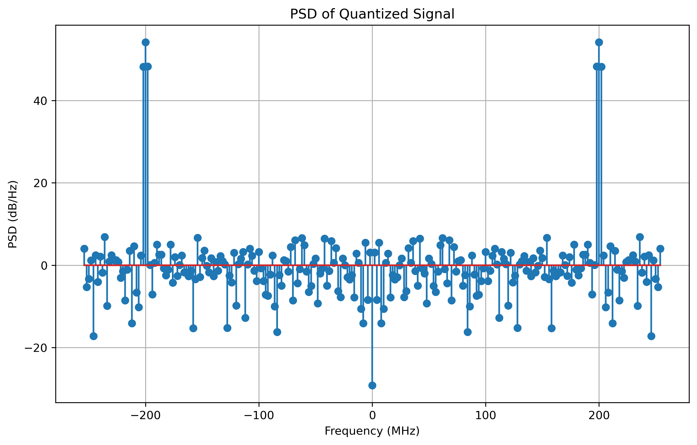
Now SNR = 37.2dB

The conclusion is that, if the original signal located perfectly on the bin, with no leakage, then there is no need, even with harm, to add a window. Only when there is detectable leakage, use a bin, and you may need further collection to the windowed signal.  