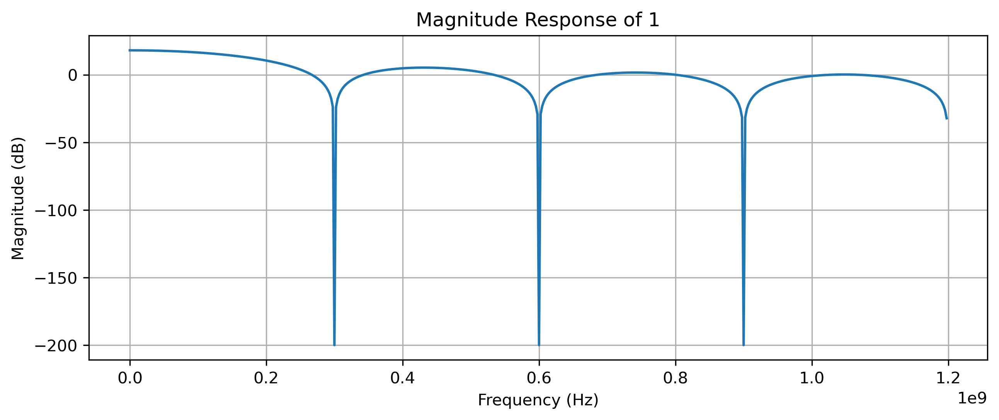
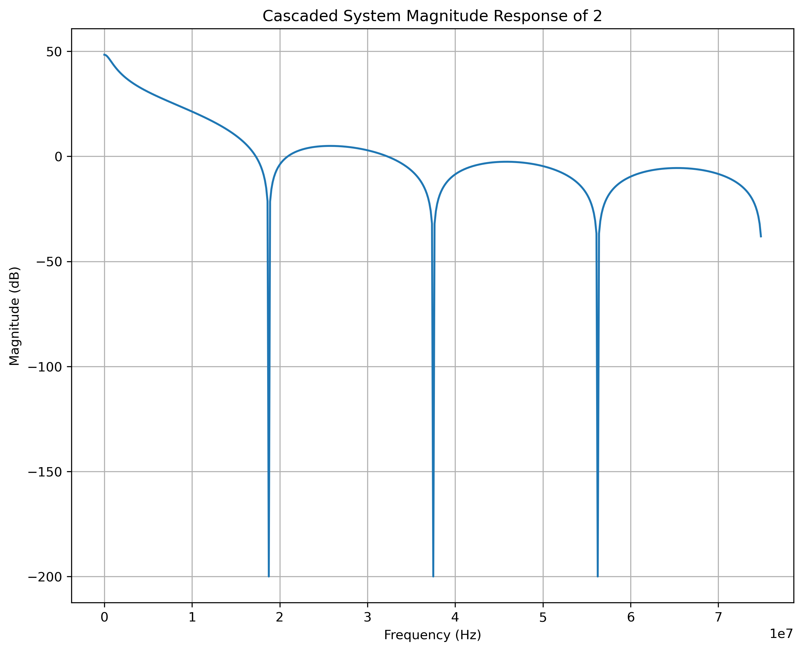
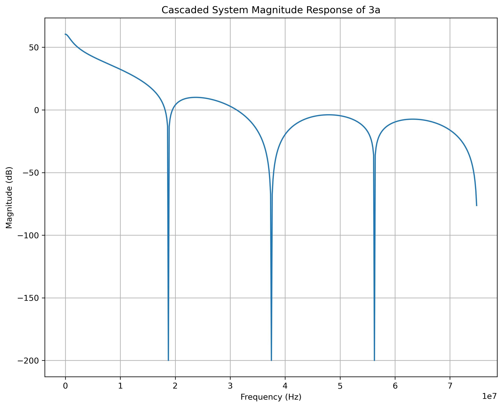
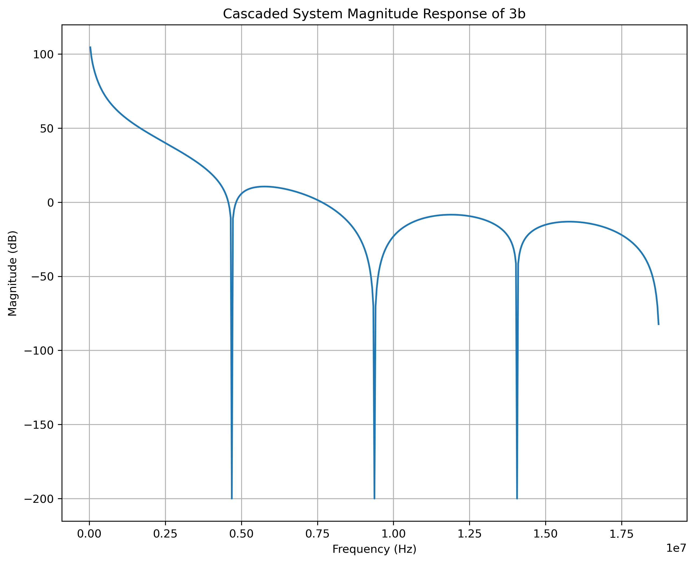

# <h1 align="center"> Lab3 Report
## 1 
In N cycles, 1 comparator is charged with current $i_{RF} = g_m*V_{in}$, then read out and discharged totally at the end. Then in another N cycles, the other capacitor continues. Here a N cycle decimation based on $f_{LO}$ is not included.  
So the transfer function is
$$H(z) = \sum_{i=1}^N u*z^{i-1}$$
Where  
$$ u=T*g_m / 2 C_s$$
The result is given as below, ignoring the coefficient when plotting transfer function 

 

## 2
First, based on 1, it includes a 2N decimation and memory process, by adding a history capacitor. Each $C_R$ capacitor comes back discharged after transferring its charge out to the output capacitor $C_F$ whereas $C_H$ always keeps a fraction of the previous cycle total charge at the middle node. 

By adding this, an IIR filter with sampling frequency of $f_{LO}/N$ is created. Consider only IIR: 
$$H(z) = \frac{1}{1-a_1*z^{-1}}$$
Where $a_1 = \frac{C_H}{C_H+C_R}$
Remember its system frequency is $f_{LO}/N$
Now the cascaded system goes like 

 

Compared to 1, the magnitudes of side lobes are lower. 

## 3
### a
Based on 2, the 4 capacitors' charge is collected in reading phase, and then discharged. So another FIR is performed, similar to 1. 
The 3rd system cascaded to 2 is: 
$$H(z) = \sum_{i=1}^L v*z^{i-1}$$
Where v is decided by read out operation, which is not shown in the topology. We assume it's 1 here. 
Now the cascaded system goes like 

 

Compared to 2, the rejection applied by the 2nd FIR on its zeros the same as the 1st FIR, is significantly improved. 

### b
If never discharged, based on 3a, the output of last time is always stored and added to next readout. So based on 3a, there is another IIR filter cascaded to 3a, and the system frequency now is of $f_{LO}/(N*L)$ 
The IIR system goes like
$$H(z) = \frac{1}{1-z^{-1}}$$
Now the cascaded system goes like 

 

### c
In this case, in different phase of charging, the coefficient of $a_i = \frac{C_H}{C_H+C_{Ri}}$ is different, causing different charge to add in different L phase. 
Consider memory, splitting charge, and read out together:
$$H(z) = \sum_{i=1}^L v(i)*z^{i-1}$$ 
Where 
$$v(i) = \frac{1}{1-a_i*z^{-1}}$$
Assume $CR = [0.5e-12, 2e-12, 4e-12, 8e-12]$, now system:

 

Compared to 3a, the shape of rejection in the middle changes. 