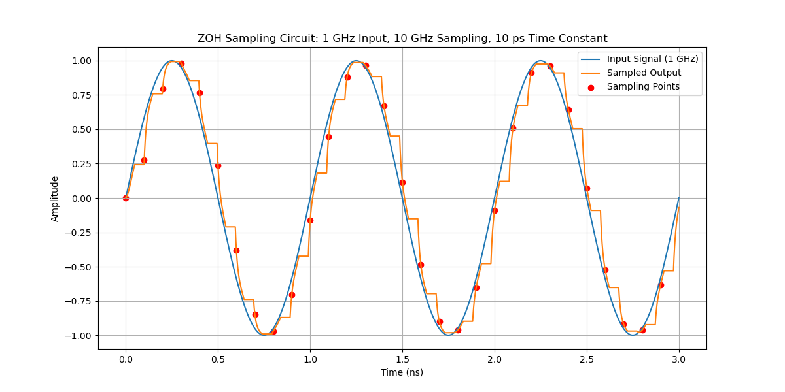
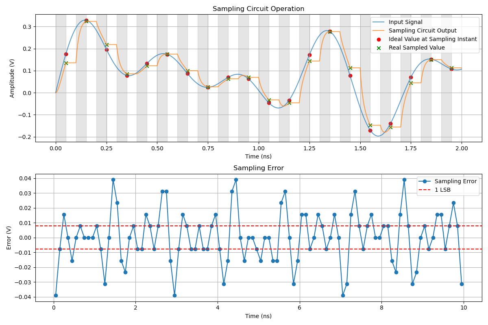
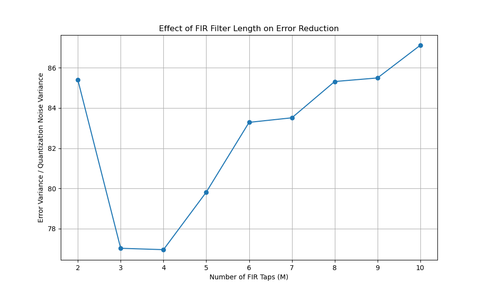
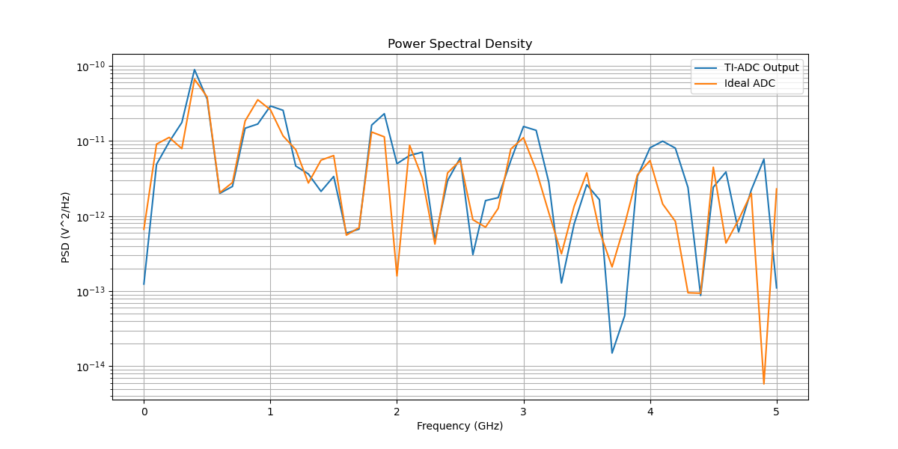

# Lab 4 Report
## 1
In sampling phase, the model is derived from the differential equation below:  
$$ V_{out} = V_{in} - τ × dV_{out}/dt$$

 

## 2
### a
1 LSB equals to 7.81mV, in each sampling phase there is 100/2 = 50ps settling time margin. When charging the sampling capacitor: 

$$ V_c(t) = V_{in} * (1 - e^{-t/τ})$$

At the end of given sampling time, the final $V_c$ should have an error less than 1LSB, than ideal value. The error can be derived as: 

$$ Error = V_{in} - V_c(t) = V_{in} * e^{(-t/τ)} $$

Solve for the maximum $τ$ when $ V_{in}$ is maximum: 

$$ τ < -t/ln(LSB/V_{in}) $$

Therefore: 

$$ τ < 12.02ps$$

### b
Instead of the NRZ signal, for a tone signal, slewing problem rises. Now the signal is changing rapidly, associated with its frequency, in each sampling phase. Consider Ohm's law and capacitor charging: 
$$I = (V_{in} - V_{out})/R$$
$$I = C × dV_{out}/dt$$
Then 
$$ V_{out} = V_{in} - τ × dV_{out}/dt$$
So
$$Error = τ × dV_{out}/dt$$
When zero-crossing, each tone requires a max slew rate: 
$$ SR = \frac{dV}{dt} | _{t=0} = 2\pi fA$$
When $f_{in} = 2.4GHz$, the maximum SR is 7550 V/us, assume each tone has a 0.5V amplitude. Then: 
$$ τ < LSB / SR = 1.03ps$$
Compared to 2.a result, for a NRZ input, the only need is to leave enough settling time, for each τ, however, when the signal is changing, the signal will follow a settle and track procedure, first we need to charge with a fixed τ to reach the signal, then track it with a error related to τ and slew rate at the end of sampling. The actual τ should be worse due to multiple tone's slewing. 

## 3
### a
If use 2.a's τ to do the sample, there will be a large error as illustrated below, in many situations, the output failed to catch up the input. In this model you will need to maximize your model resolution, here for each sampling point, I use 1e6 points for the procedure.  

 

Here is the sampling error summary: 

3.a - Sampling Error Estimation:
  - Number of samples: 500
  - Error variance: 3.181143e-04 V²
  - Quantization noise variance: 5.086263e-06 V²
  - Ratio of error variance to quantization noise variance: 62.5438
  - Maximum error: 4.687500e-02 V (6.00 LSB)
  - Samples exceeding 1 LSB: 237 (47.40% of total)

### b
The strange thing is that this calibration doesn't make an improvement, all the values are higher than before. 

 

## 4

 

4.a - Two-Channel TI-ADC Simulation:
  - Time mismatch: 10.0% of Ts
  - Offset mismatch: 0.050 V
  - Bandwidth mismatch: 20.0%
  - Time constant channel 1: 6.01 ps
  - Time constant channel 2: 7.21 ps
  - SNDR: 4.06 dB
