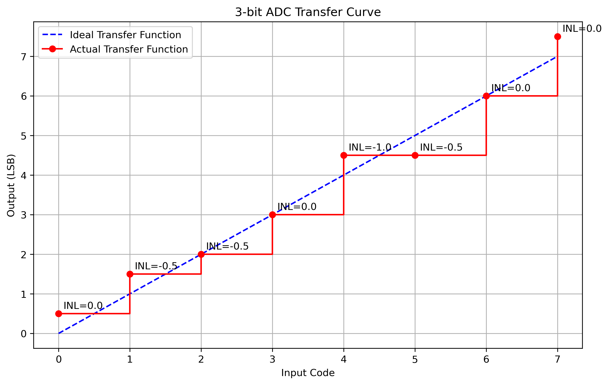

# 1
## a
Because compared to a full scale input, the input signal power is only $ 2* 0.2^2 / 0.6^2 = 2/9$, so there is a $-10log2/9 = 6.53dB$ drop to ideal SQDR. 
$$SNR = 6.02N + 1.76 - 6.53 = 67.47dB$$

## b
The noise's power is its variance, $0.25 V^2$. While the signal power is $0.6^2/2 = 0.18V^2$. So the input SNR is: 
$$SNR = P_{sig,dB} - P_{noise,dB} = -1.42dB$$
After passing quantization, a $\Delta^2/12 = 7.15*10^{-9}$ noise is addictive added: 

$$SNR = 10lg \frac{P_{sig}}{P_{inputnoise}+P_{qnoise}} \approx -1.42dB$$

Dominated by input noise. 

## c
The uniformly distributed noise power is $1/12 V^2$, then input SNR: 
$$SNR = 10lg \frac{P_{sig}}{P_{inputnoise}} = 0.334dB$$
Still output SNR is dominated by the input noise:
$$SNR = 10lg \frac{P_{sig}}{P_{inputnoise}+P_{qnoise}} \approx 0.334dB$$

# 2
Because total quantization noise is uniformly distributed in a wider frequency, and the noise is shaped (rejected) by the fliter. Consider only the in-band noise, it is dropped $K$ times. Then SNR is :
$$SNR = 6.02N + 1.76 + 10lgK $$

# 3
## a
Offset is $-0.01 / 0.1 = -0.1 LSB$. 
Full-scale error is $(0.75 - 0.7)/0.1 = 0.5LSB$.

## b
Ideal gain is $1LSB/code$
Actual gain is $0.76/7/0.1 = 1.086LSB/code$
So gain error is $0.086 LSB/code$

## c
End-point corrected ideal values:

Step size = (0.75V - (-0.01V))/7 = 0.1086V
Code 000: -0.01V
Code 001: -0.01V + 0.1086V = 0.0986V
Code 010: -0.01V + 2×0.1086V = 0.2071V
Code 011: -0.01V + 3×0.1086V = 0.3157V
Code 100: -0.01V + 4×0.1086V = 0.4243V
Code 101: -0.01V + 5×0.1086V = 0.5329V
Code 110: -0.01V + 6×0.1086V = 0.6414V
Code 111: 0.75V

DNL calculation (in LSB):

DNL[000-001] = (0.105-(-0.01))/0.1086 - 1 = 0.064 LSB
DNL[001-010] = (0.195-0.105)/0.1086 - 1 = -0.174 LSB
DNL[010-011] = (0.28-0.195)/0.1086 - 1 = -0.217 LSB
DNL[011-100] = (0.37-0.28)/0.1086 - 1 = -0.171 LSB
DNL[100-101] = (0.48-0.37)/0.1086 - 1 = 0.018 LSB
DNL[101-110] = (0.6-0.48)/0.1086 - 1 = 0.105 LSB
DNL[110-111] = (0.75-0.6)/0.1086 - 1 = 0.38 LSB

INL calculation (in LSB):

INL[000] = ((-0.01)-(-0.01))/0.1086 = 0 LSB
INL[001] = (0.105-0.0986)/0.1086 = 0.059 LSB
INL[010] = (0.195-0.2071)/0.1086 = -0.111 LSB
INL[011] = (0.28-0.3157)/0.1086 = -0.329 LSB
INL[100] = (0.37-0.4243)/0.1086 = -0.5 LSB
INL[101] = (0.48-0.5329)/0.1086 = -0.487 LSB
INL[110] = (0.6-0.6414)/0.1086 = -0.381 LSB
INL[111] = (0.75-0.75)/0.1086 = 0 LSB

## d
Maxium DNL = 0.38 LSB
Maxium INL = 0.5 LSB

# 4
## a
Based on the histogram code result, the transition function of ideal and real are: 

Then DNL can be calculated:

INL can be accumulated by DNL, is:

## b
Based on the result, DNL max = -0.6568LSB, INl max = 0.8316LSB

## c
Because minimum DNL=-0.6568 > -1.0, it is monotonic. Otherwise the result from histogram is useless. 

# 5

# 6
## a
FS SQDR is: 
$$SQDR = 6.02N + 1.76$$

## b
Now the noise power is distributed uniformly to L/2 bins(up to Nyquist Freq) as the noise floor, while the signal power remains the same at a specific bin.
Consider the power in dB
$$Signal to Noise Floor Ratio = 6.02N + 1.76 + 10lg(L/2)$$

## c
The input signal frequency should fall on a specific signal bin with no leakage to all other noise bins, and input signal should uncorrelated to the quantization noise. 
$fs/fin = L/C$ Where gcd(N,C)=1 
These are necessary but still not enough to create a totally flat noise floor, with some small spurs on the noise floor. 

## d
Now the noise floor is also shaped by the digital filter. By calculating the integration(area) of the rejected 2 triangles, the total eliminated noise power is:
$$P_{noise,dropped} = \frac{B^2}{(A-B)A} * F_s/4 $$
Then SNR is improved by this value in dB

# 7
## a 
When Φ₁ is HIGH and Φ̄₁ is LOW:

Transistors M1 and M2 operate in saturation region, forming a differential input pair
M3 and M4 act as MOS resistor loads in triode region
M5 and M6 are OFF (since Φ̄₁ is LOW)
The circuit operates as a preamplifier with open-loop gain
The differential input (V₁⁺ - V₁⁻) is amplified at the outputs (V₀⁺ - V₀⁻)

When Φ₁ is LOW and Φ̄₁ is HIGH:

M1 and M2 are turned OFF, disconnecting the input from the circuit
M5 and M6 turn ON and operate in saturation region
M3 and M4 continue to operate in triode region
The circuit enters regenerative mode with positive feedback through the cross-coupled pair M5 and M6
The small voltage difference at the outputs gets amplified until it reaches the rails (VDD and GND)

## b 
In differential mode, consider the 2 phases together:
$$V_o = G_1V_i + G_2V_o$$
SO
$$V_o = \frac{G_1}{1-G_2}V_i$$
Where:

G₁ is the open-loop gain of the differential pair (M1-M4)
G₂ is the positive feedback gain from the cross-coupled pair (M5-M6)

# c
Static Latches:

Advantages:

Can hold data indefinitely without refreshing
More robust against noise and clock glitches
Less sensitive to charge leakage

Disadvantages:

Higher power consumption
Larger area (more transistors)
Typically slower due to higher capacitive load

Dynamic Latches:

Advantages:

Lower power consumption
Smaller area (fewer transistors)
Often faster due to lower capacitive load

Disadvantages:

Cannot hold data indefinitely (requires periodic refreshing)
More sensitive to noise and leakage
Less reliable at low clock frequencies

## d
This is a semi-dynamic latch because it dynamicly amplifies input voltage, and regenerate statically.
